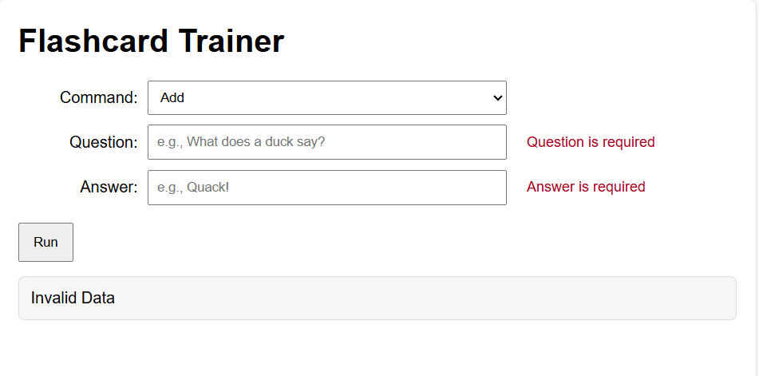
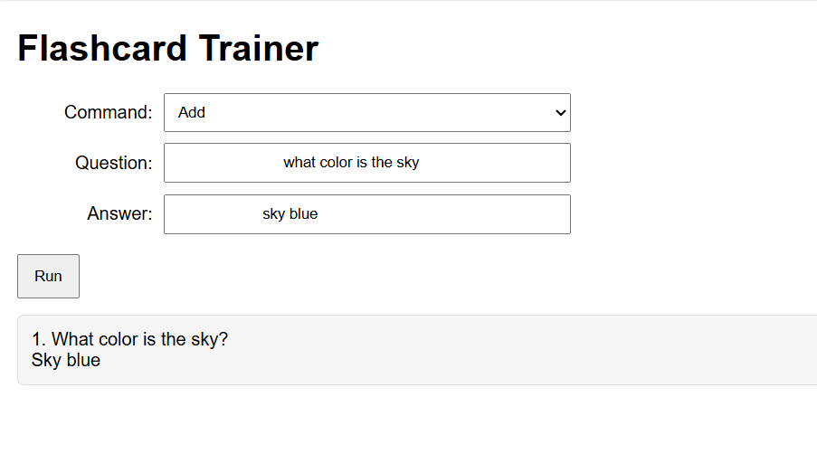
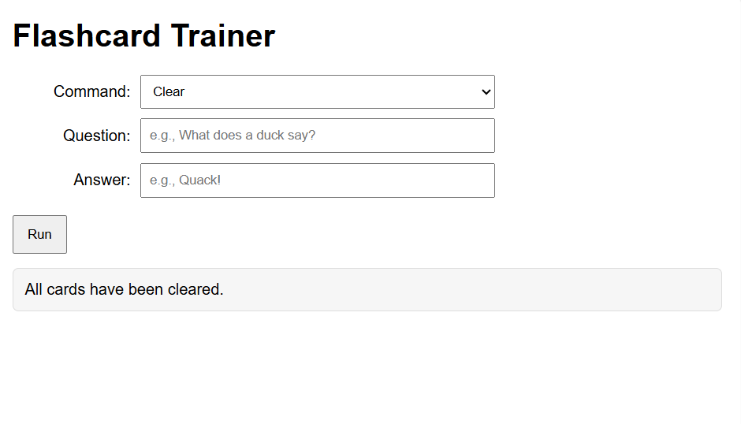
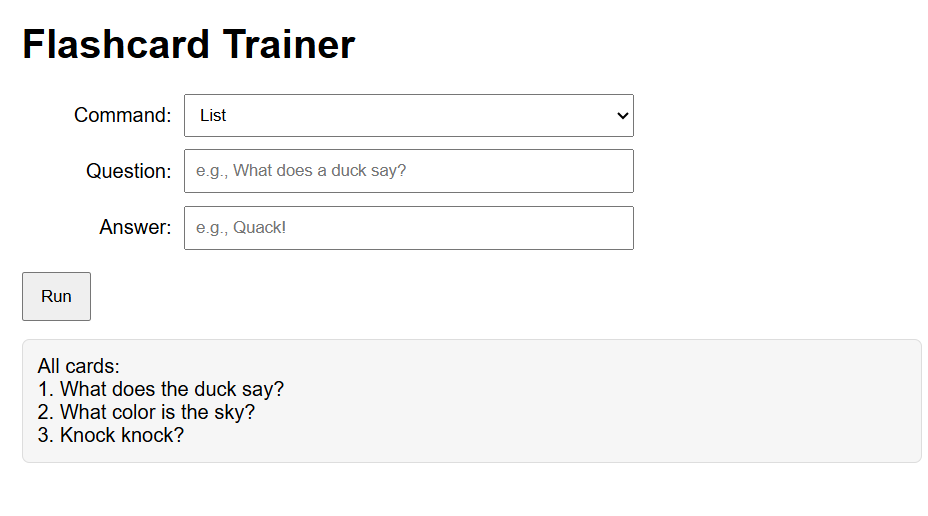

# Flash Cards

<b>Table of Contents</b>
- [Summary](#summary)
- [Screenshots](#screenshots)
  - [Data Validation](#validation)
  - [Add Question](#add-question)
  - [Clear Questions](#clear-questions)
  - [Load Default Questions](#load-default-questions)
  - [List Questions](#list-questions)
  - [Quiz](#quiz)
- [Maintainers](#maintainers)

## Summary
Welcome to your own personal Flashcard Trainer!
-----------------------------------------------
Need a better way to study? Use this site for all your studying needs. 
 
The purpose of this program is to help simulate flashcards as a web application.
All you need to do is fill out the fields, whether you want to add, list, or quiz yourself
over your flashcards. You can even delete and load default questions!

## Screenshots

### Validation

### Add Question

### Clear Questions

### Load Default Questions

### List Questions

### Quiz

### Maintainers
[@tarath01](https://github.com/tarath01) Taylor Rath  

[Back to the Top](#flash-cards)
